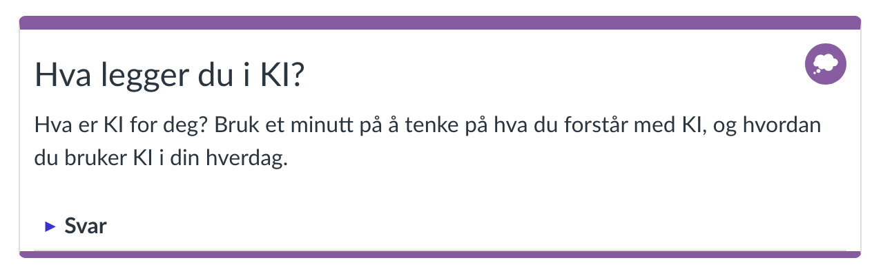
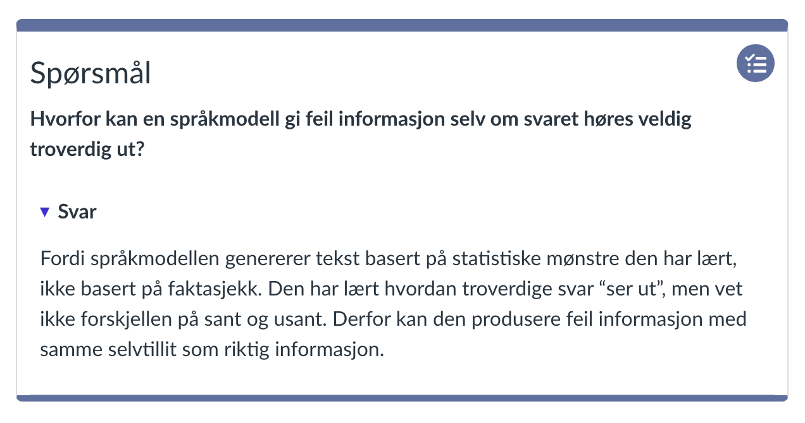
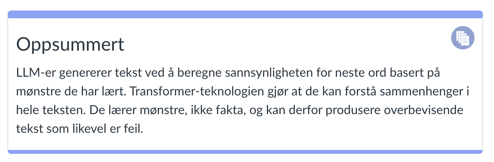

# Bidra til Grunnkurs KI

Dette dokumentet gir retningslinjer for å bidra til innholdet i Grunnkurs KI, med fokus på de tilpassede UiO-direktivene som brukes i prosjektet.

## VIKTIG: Linjeskift og innrykk i reStructuredText

**reStructuredText (RST) er svært følsomt for linjeskift og innrykk.** Feil formatering kan føre til at direktivene ikke fungerer eller at innholdet ikke vises korrekt.

### Viktige regler:

1. **Blank linje etter direktivet**: Etter et direktiv (f.eks. `.. uio-exercise::`) må det alltid være en blank linje før innholdet starter.

2. **Konsistent innrykk**: Alt innhold som hører til et direktiv må ha samme innrykk (vanligvis 3 mellomrom).

3. **Ingen ekstra mellomrom**: Pass på at du ikke har ekstra mellomrom på slutten av linjer eller blanke linjer med mellomrom.

4. **Nøstede direktiver**: Når du nøster direktiver (f.eks. `.. uio-solution::` inne i `.. uio-exercise::`), må det indre direktivet ha ytterligere innrykk (3 ekstra mellomrom).

### Riktig eksempel:
```rst
.. uio-exercise:: Øvelse 1

   Dette er innholdet i øvelsen.

   .. uio-solution::

      Dette er løsningen.
```

### Feil eksempel (vil IKKE fungere):
```rst
.. uio-exercise:: Øvelse 1
   Dette er innholdet i øvelsen.    (mangler blank linje)

.. uio-exercise:: Øvelse 2
Dette er feil innrykk.    (mangler innrykk)
```

---

## Oversikt

Dette prosjektet bruker Sphinx med Read the Docs-temaet for å bygge kursinnhold som er kompatibelt med UiO Canvas. Kursinnholdet er skrevet i reStructuredText (RST)-format og ligger i `source/episodes/`-katalogen.

## Tilpassede UiO-direktiver

Prosjektet inkluderer tilpassede Sphinx-utvidelser i `source/_ext/`-katalogen som tilbyr UiO-spesifikke komponenter. Disse direktivene genererer HTML i henhold til UiOs designretningslinjer fra [UiO Canvas designelementer](https://www.uio.no/for-ansatte/arbeidsstotte/sta/canvas/veiledninger/utnytt-mulighetene/designelementer.html).

### Canvas-faner (`canvas_tabs.py`)

Canvas-kompatible faner som bruker HTML med URL-fragmenter (ingen JavaScript nødvendig).


#### `.. canvas-tabs::`

Containerdirektiv for å lage faneinnhold.

**Bruk:**

```rst
.. canvas-tabs::

   .. canvas-tab:: Fanetittel 1

      Innhold for fane 1

   .. canvas-tab:: Fanetittel 2

      Innhold for fane 2
```

**Eksempel på resultat**


-------------------------

#### `.. canvas-tab:: Fanetittel`

Individuelt fanedirektiv. Tittelen oppgis som et argument etter direktivet.

**Bruk:**

```rst
.. canvas-tab:: Introduksjon

   Dette er innholdet i introduksjonsfanen.
```

-------------------------


### UiO-komponenter (`uio_components.py`)

UiO-spesifikke komponenter som følger Universitetet i Oslos designretningslinjer.

#### `.. uio-exercise:: Egendefinert tittel`

Øvelsescontainer med oppgaveikon. Kan inkludere en sammenleggbar løsning.

**Standardtittel:** `Oppgave`

**Bruk:**

```rst
.. uio-exercise:: Øv på å lage prompter

   Prøv å skrive en prompt for å generere et sammendrag av denne teksten.

   .. uio-solution::

      Her er en eksempelløsning...
```

-------------------------


#### `.. uio-reflect:: Egendefinert tittel`

Refleksjonsøvelsescontainer med refleksjonsikon (lilla farge). Brukes for refleksjonsøvelser der deltakerne skal tenke over et tema. Kan inkludere en sammenleggbar løsning.

**Standardtittel:** `Refleksjon`

**Bruk:**

```rst
.. uio-reflect:: KI-etikk

   Vurder de etiske implikasjonene ved å bruke KI i ditt daglige arbeid.

   .. uio-solution::

      Noen punkter å vurdere...
```

**Eksempel på resultat**




-------------------------


#### `.. uio-question:: Egendefinert tittel`

Spørsmålscontainer med oppgaveikon. Kan inkludere et sammenleggbart svar.

**Standardtittel:** `Spørsmål`

**Bruk:**

```rst
.. uio-question:: Hva er en språkmodell?

   Hvordan ville du forklart en språkmodell til en kollega?

   .. uio-answer::

      En språkmodell er...
```

**Eksempel på resultat**




-------------------------

#### `.. uio-solution::`

Sammenleggbart løsningsdirektiv (trekkspill). Må være nøstet inni `.. uio-exercise::` eller `.. uio-reflect::`.

**Bruk:**

```rst
.. uio-solution::

   Dette innholdet vil være skjult bak en "Løsning"-knapp.
```

-------------------------


#### `.. uio-answer::`

Sammenleggbart svardirektiv (trekkspill). Må være nøstet inni `.. uio-question::`.

**Bruk:**

```rst
.. uio-answer::

   Dette innholdet vil være skjult bak en "Svar"-knapp.
```

-------------------------

#### `.. uio-dont:: Egendefinert tittel`

Advarsel/ikke-gjør-container med advarselsikon.

**Standardtittel:** `OBS!`

**Bruk:**

```rst
.. uio-dont:: Viktig advarsel

   Del aldri sensitive personopplysninger med offentlige KI-verktøy.
```

**Eksempel på resultat**


-------------------------


#### `.. uio-info:: Egendefinert tittel`

Informasjonsboks med informasjonsikon (blå "i"-ikon).

**Standardtittel:** `Info`

**Bruk:**

```rst
.. uio-info:: Viktig informasjon

   UiO tilbyr flere KI-tjenester for ansatte og studenter.
```

**Merk:** Dette direktivet erstatter det tidligere `uio-note` direktivet.

-------------------------

#### `.. uio-source:: Egendefinert tittel`

Kilde/ressurser-container med kildeikon. Brukes for å liste kilder, ressurser eller nettsider.

**Standardtittel:** `Kilder / Ressurser`

**Bruk:**

```rst
.. uio-source:: Nyttige ressurser

   - https://www.uio.no/tjenester/it/ki/
   - ChatGPT dokumentasjon
   - Claude AI dokumentasjon
```

-------------------------

#### `.. uio-do:: Egendefinert tittel`

Tips/gjør-container med avkryssingsikon.

**Standardtittel:** `Tips`

**Bruk:**

```rst
.. uio-do:: God praksis

   Alltid verifiser KI-generert innhold før du bruker det i arbeidet ditt.
```

**Eksempel på resultat**


-------------------------


#### `.. uio-icon-box::`

Generisk ikonbokscontainer. Bruk denne når du trenger en tilpasset container.

**Bruk:**

```rst
.. uio-icon-box::

   .. uio-detail:: Mer informasjon

      Ytterligere detaljer som kan være skjult.
```

**Eksempel på resultat**




-------------------------


#### `.. uio-detail:: Oppsummeringstekst`

Detaljer/trekkspill-element som bruker HTML `<details>`- og `<summary>`-tagger.

**Standard oppsummering:** `Detaljer`

**Bruk:**

```rst
.. uio-detail:: Klikk for å utvide

   Dette innholdet er skjult som standard og kan utvides ved å klikke.
```

-------------------------

#### `.. uio-colorbox-1::`, `.. uio-colorbox-2::`, `.. uio-colorbox-3::`

Fargede bokser uten ikon. Brukes for å fremheve innhold med ulike farger.

**Bruk:**

```rst
.. uio-colorbox-1:: Valgfri overskrift

   Innhold i fargeboks 1.

.. uio-colorbox-2::

   Innhold uten overskrift i fargeboks 2.

.. uio-colorbox-3:: En annen overskrift

   Innhold i fargeboks 3.
```

**Merk:** Overskriften er valgfri. Hvis du ikke angir overskrift, vil boksen kun inneholde innholdet uten `<h3>`-tag.

-------------------------

## Legge til figurer

Du kan legge til figurer på følgende måte:

```rst
.. figure:: ../images/ChatGPT_howLLMswork.png
   :align: center
   :width: 60%
   :alt: Illustrasjon av tekstgenerering med LLM
```

-------------------------

## Nyttig Sphinx-dokumentasjon

- [reStructuredText Primer](https://www.sphinx-doc.org/en/master/usage/restructuredtext/basics.html)
- [Read the Docs Theme-dokumentasjon](https://sphinx-rtd-theme.readthedocs.io/)


---

## Bygge dokumentasjonen

For å bygge dokumentasjonen lokalt:

```bash
cd ki-kurs-intro
python -m venv venv
source venv/bin/activate
pip install -r requirements.txt
make html
```

Den bygde HTML-en vil være i `_build/html/episodes`.

---

## Arbeidsflyt

1. Rediger RST-filer i `source/episodes/`
2. Commit endringer til GitHub
3. GitHub Actions vil automatisk bygge HTML-filene
4. HTML-filer lagres i `html-pages`-grenen
5. Oppdater Canvas-sider enten manuelt eller via REST API-skriptet

For detaljerte arbeidsflysinstruksjoner, se hoved-[README.md](README.md).

---

## Canvas-kompatibilitet

Alle tilpassede direktiver er designet for å være kompatible med UiO Canvas. Den genererte HTML-en:
- Bruker UiO-spesifikke CSS-klasser:
  - Ikonbokser: `uio-icon-box` med varianter `task`, `reflect`, `source`, `do`, `dont`, `info`
  - Fargebokser: `uio-color-box-1`, `uio-color-box-2`, `uio-color-box-3`
- Unngår JavaScript der det er mulig (faner bruker URL-fragmenter)
- Følger UiOs designretningslinjer for tilgjengelighet og visuell konsistens

## Endringer og oppdateringer

**Fjernede direktiver:**
- `uio-note` - erstattet med `uio-info` for informasjonsbokser og `uio-source` for kilder/ressurser

**Nye direktiver:**
- `uio-info` - informasjonsboks med blått info-ikon
- `uio-source` - kilde/ressurser-boks med kildeikon
- `uio-colorbox-1`, `uio-colorbox-2`, `uio-colorbox-3` - fargede bokser uten ikon


