# Bidra til Grunnkurs KI

Dette dokumentet gir retningslinjer for å bidra til innholdet i Grunnkurs KI, med fokus på de tilpassede UiO-direktivene som brukes i prosjektet.

## VIKTIG: Linjeskift og innrykk i reStructuredText

**reStructuredText (RST) er svært følsomt for linjeskift og innrykk.** Feil formatering kan føre til at direktivene ikke fungerer eller at innholdet ikke vises korrekt.

### Viktige regler:

1. **Blank linje etter direktivet**: Etter et direktiv (f.eks. `.. uio-task::`) må det alltid være en blank linje før innholdet starter.

2. **Konsistent innrykk**: Alt innhold som hører til et direktiv må ha samme innrykk (vanligvis 3 mellomrom).

3. **Ingen ekstra mellomrom**: Pass på at du ikke har ekstra mellomrom på slutten av linjer eller blanke linjer med mellomrom.

4. **Nøstede direktiver**: Når du nøster direktiver (f.eks. `.. uio-answer::` inne i `.. uio-task::`), må det indre direktivet ha ytterligere innrykk (3 ekstra mellomrom).

### Riktig eksempel:
```rst
.. uio-task:: Øvelse 1

   Dette er innholdet i øvelsen.

   .. uio-answer::

      Dette er svaret.
```

### Feil eksempel (vil IKKE fungere):
```rst
.. uio-task:: Øvelse 1
   Dette er innholdet i øvelsen.    (mangler blank linje)

.. uio-task:: Øvelse 2
Dette er feil innrykk.    (mangler innrykk)
```

---

## Oversikt

Dette prosjektet bruker Sphinx med Read the Docs-temaet for å bygge kursinnhold som er kompatibelt med UiO Canvas. Kursinnholdet er skrevet i reStructuredText (RST)-format og ligger i `source/episodes/`-katalogen.

## Tilpassede UiO-direktiver

Prosjektet inkluderer tilpassede Sphinx-utvidelser i `source/_ext/`-katalogen som tilbyr UiO-spesifikke komponenter. Disse direktivene genererer HTML i henhold til UiOs designretningslinjer fra [UiO Canvas designelementer](https://www.uio.no/for-ansatte/arbeidsstotte/sta/canvas/veiledninger/utnytt-mulighetene/designelementer.html).

## Canvas-faner (`canvas_tabs.py`)

Canvas-kompatible faner som bruker HTML med URL-fragmenter (ingen JavaScript nødvendig).


### canvas-tabs

Containerdirektiv for å lage faneinnhold.

**Bruk:**

```rst
.. canvas-tabs::

   .. canvas-tab:: Fanetittel 1

      Innhold for fane 1

   .. canvas-tab:: Fanetittel 2

      Innhold for fane 2
```

**Merk:**
- `.. canvas-tab::` må alltid være nøstet inne i `.. canvas-tabs::`
- Tittelen for hver fane oppgis som et argument etter `.. canvas-tab::`

**Eksempel på resultat**

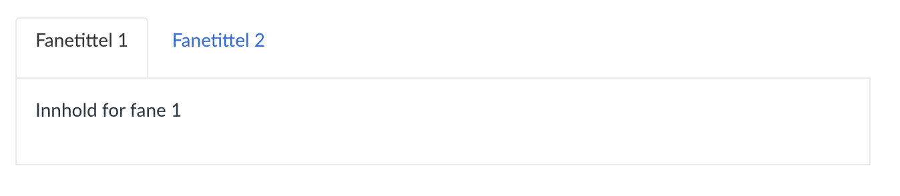


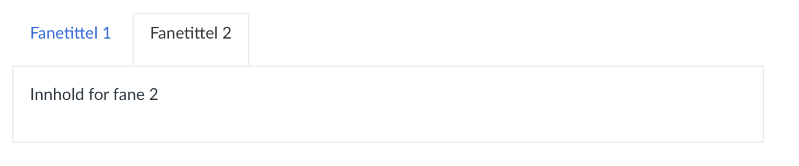

-------------------------


## UiO-komponenter (`uio_components.py`)

UiO-spesifikke komponenter som følger Universitetet i Oslos designretningslinjer.

### uio-task

Oppgavecontainer med oppgaveikon. Kan inkludere et sammenleggbart svar.

**Standardtittel:** `Oppgave`

**Bruk:**

```rst
.. uio-task:: Øv på å lage prompter

   Prøv å skrive en prompt for å generere et sammendrag av denne teksten.

   .. uio-answer::

      Her er en eksempelløsning...
```

**Eksempel på resultat**

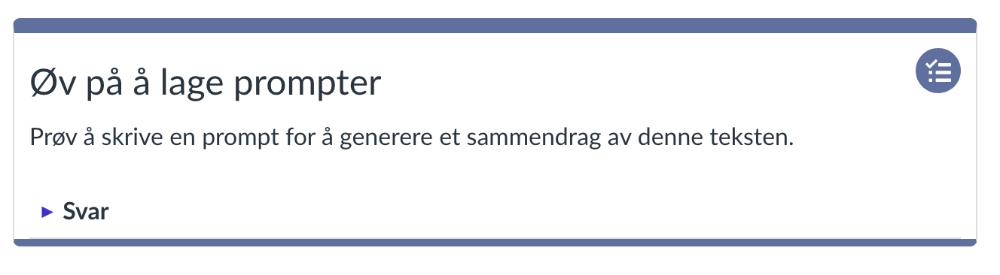


-------------------------


### uio-answer

Sammenleggbart svardirektiv (trekkspill). Kan være nøstet inni alle ikonboksdirektiver (mest brukt i `.. uio-task::` og `.. uio-reflect::`).

**Standardtittel:** `Svar`

**Bruk:**

```rst
.. uio-answer::

   Dette innholdet vil være skjult bak en "Svar"-knapp.
```


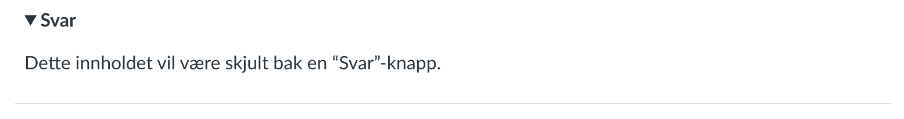


```rst 
.. uio-answer:: Løsningsforslag

   Du kan også gi en egendefinert tittel.
```


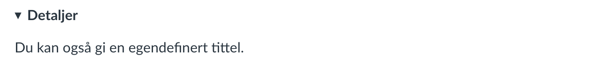

-------------------------


### uio-detail

Detaljer/trekkspill-element som bruker HTML `<details>`- og `<summary>`-tagger.

**Standard oppsummering:** `Detaljer`

**Bruk:**

```rst
.. uio-detail:: Klikk for å utvide

   Dette innholdet er skjult som standard og kan utvides ved å klikke.
```

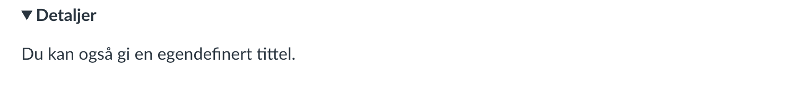

-------------------------


### uio-reflect

Refleksjonsøvelsescontainer med refleksjonsikon (lilla farge). Brukes for refleksjonsøvelser der deltakerne skal tenke over et tema. Kan inkludere en sammenleggbar løsning.

**Standardtittel:** `Refleksjon`

**Bruk:**

```rst
.. uio-reflect:: KI-etikk

   Vurder de etiske implikasjonene ved å bruke KI i ditt daglige arbeid.

   .. uio-answer::

      Noen punkter å vurdere...
```

**Eksempel på resultat**

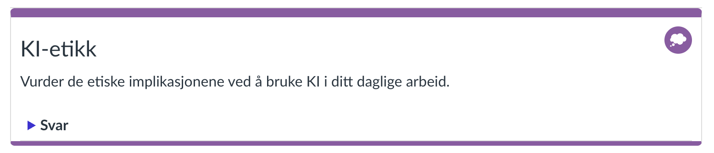


-------------------------

### uio-do

Tips/gjør-container med avkryssingsikon.

**Standardtittel:** `Tips`

**Bruk:**

```rst
.. uio-do:: God praksis

   Alltid verifiser KI-generert innhold før du bruker det i arbeidet ditt.
```

**Eksempel på resultat**

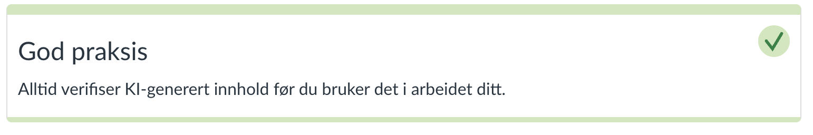

-------------------------

### uio-dont

Advarsel/ikke-gjør-container med advarselsikon.

**Standardtittel:** `OBS!`

**Bruk:**

```rst
.. uio-dont:: Viktig advarsel

   Del aldri sensitive personopplysninger med offentlige KI-verktøy.
```

**Eksempel på resultat**

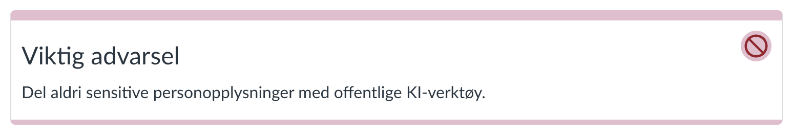

-------------------------

### uio-do-dont

Container for å vise gjør/ikke-gjør-innhold side-ved-side i et rutenett. Dette direktivet er perfekt for å vise sammenligninger og kontraster mellom anbefalte og ikke-anbefalte handlinger.

**Bruk:**

```rst
.. uio-do-dont::

   .. uio-do:: Gjør 

      Anbefalte handlinger:

      - Bruk spesifikke og klare instruksjoner
      - Oppgi kontekst i promptene dine
      - Verifiser alltid KI-generert innhold

   .. uio-dont:: Ikke gjør 

      Handlinger å unngå:

      - Ikke stol blindt på KI-svar
      - Ikke del sensitive data med offentlige KI-verktøy
      - Ikke hopp over kvalitetskontroll
```

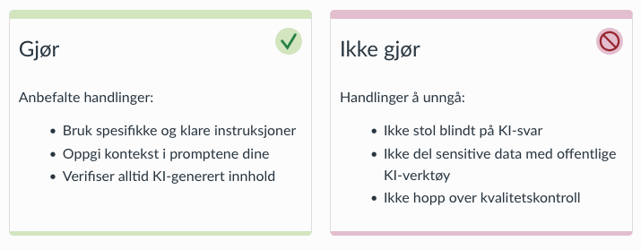

**Merk:**
- `uio-do` og `uio-dont` direktivene inne i `uio-do-dont` får automatisk `col-lg`-klassen for riktig rutenettsoppsett
- Både `uio-do` og `uio-dont` kan også brukes standalone (utenfor `uio-do-dont`) for enkeltkolonneoppsett

-------------------------


### uio-grid / uio-grid-item

Bilder, designelementer eller annet innhold side ved side i kolonner. Direktivet lager Canvas
sin egen rutenett-markup (`grid-row` / `col-xs`), så det som lastes opp til
Canvas inneholder bare Canvas-klasser og inline-stiler:

```html
<div style="display: flex; flex-wrap: wrap;">
    <div class="grid-row" style="grid-gap: 5%; margin: 1rem 0; width: 100%;">
        <div class="col-xs" style="padding: 0;">
            <figure style="margin: 0;">
                <figcaption>Bildetekst</figcaption>
            </figure>
        </div>
        ...
    </div>
</div>
```

**Opsjoner for `uio-grid`:**

- `:columns:` - antall kolonner per rad. Utelat den for å legge alle bildene på
  én rad (`col-xs` deler bredden likt, så 2, 3, 4 eller 5 bilder blir like
  brede av seg selv). Med `:columns: 3` og seks bilder får du to rader.
- `:gap:` - avstand mellom kolonnene, oppgitt som CSS-lengde (`5%`, `20px`,
  `1rem`, `2em`). Standard er `5%`.

**Opsjoner for `uio-grid-item`:**

- Argumentet er bildestien, relativt til rst-fila - akkurat som i `.. figure::`.
- `:alt:` - alternativ tekst. Settes ikke den, brukes `:caption:`.
- `:caption:` - bildeteksten, blir `<figcaption>`.
- `:width:` - bildebredde i kolonnen (CSS-lengde). Standard er `100%`.

**Bruk:**

```rst
.. uio-grid::

   .. uio-grid-item:: ../images/gpt-modellvelger.png
      :alt: Skjermbilde av modellvelgeren
      :caption: Modellvelgeren i GPT UiO

   .. uio-grid-item:: ../images/gpt-uio-modeller.png
      :alt: Skjermbilde av modell-lista
      :caption: Tilgjengelige modeller

   .. uio-grid-item:: ../images/ms-copilot.png
      :alt: Skjermbilde av Copilot
      :caption: Microsoft Copilot Chat
```

Fire bilder fordelt på to rader, med litt større avstand:

```rst
.. uio-grid::
   :columns: 2
   :gap: 20px

   .. uio-grid-item:: ../images/en.png
      :caption: En
   ...
```

**Designelementer i kolonnene:**

Alt du legger på øverste nivå inne i `uio-grid` blir én kolonne, så
designelementene (`uio-colorbox-1/2/3`, `uio-custom-box`, `uio-info`,
`uio-do`, `uio-source`, ...) kan legges rett inn i rutenettet:

```rst
.. uio-grid::

   .. uio-colorbox-3:: Overskrift

      Innhold i fargeboks.

   .. uio-custom-box:: 🟢 Grønn
      :color: gronn

      Innhold i egendefinert boks.
```

Skal en kolonne inneholde flere ting - for eksempel et bilde og en boks, eller
en boks og litt tekst - pakk dem inn i et `uio-grid-item`:

```rst
.. uio-grid::

   .. uio-grid-item::

      .. uio-info:: Til info

         Innhold i infoboksen.

      Litt tekst under boksen.

   .. uio-grid-item:: ../images/en.png
      :alt: Beskrivende tekst
      :caption: Bildetekst
```

**Merk:**
- `uio-grid-item` uten bildesti blir en vanlig tekstkolonne - alt du skriver i
  innholdet under direktivet havner i kolonnen. Skriv bildeteksten der i
  stedet for i `:caption:` hvis den trenger lenker eller annen formatering.
- Bildene kopieres inn i bygget og lastes opp til Canvas av
  `update_canvas_pages.py` på samme måte som `.. figure::`-bilder - husk å
  legge bildefilene i `source/images`.

-------------------------


### uio-info

Informasjonsboks med informasjonsikon (blå "i"-ikon).

**Standardtittel:** `Info`

**Bruk:**

```rst
.. uio-info:: Viktig informasjon

   UiO tilbyr flere KI-tjenester for ansatte og studenter.
```

**Merk:** Dette direktivet erstatter det tidligere `uio-note` direktivet.

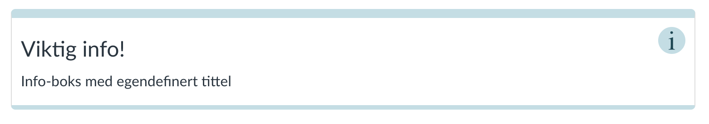


-------------------------

### uio-source

Kilde/ressurser-container med kildeikon. Brukes for å liste kilder, ressurser eller nettsider.

**Standardtittel:** `Kilder / Ressurser`

**Bruk:**

```rst
.. uio-source:: Nyttige ressurser

   - https://www.uio.no/tjenester/it/ki/
   - ChatGPT dokumentasjon
   - Claude AI dokumentasjon
```

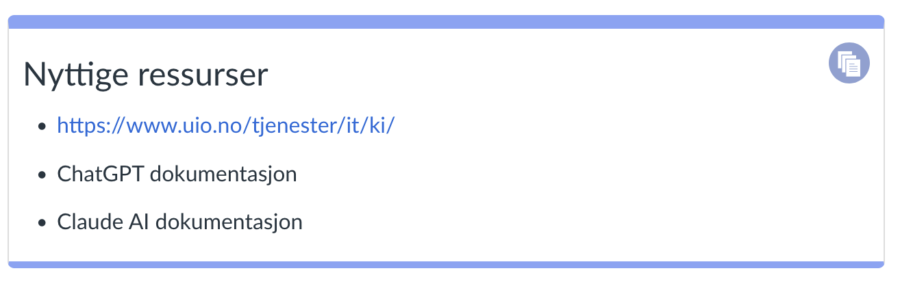

-------------------------


### uio-icon-box

Generisk ikonbokscontainer. Bruk denne når du trenger en tilpasset container.

**Bruk:**

```rst
.. uio-icon-box::

   Her kommer diverse tekst som skal inn i boksen.

   .. uio-detail:: Mer informasjon

      Ytterligere detaljer som kan være skjult.
```

**Eksempel på resultat**

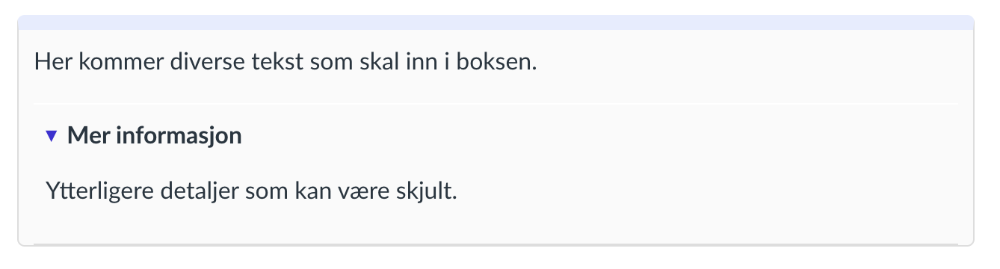


-------------------------


### uio-custom-box

Samme boks som `uio-do` / `uio-info` / `uio-dont` (tykk kantlinje øverst, tynnere
nederst), men der du selv bestemmer kantfargen. Boksen får ikke ikon.

**Opsjoner:**

- `:color:` - kantfarge. Enten et navn (`gronn`, `gul`, `rod`, `svart`, eller
  `green`, `yellow`, `red`, `black`) eller en hex-verdi (`#rgb` eller `#rrggbb`).
- `:background:` - valgfri bakgrunnsfarge, samme format som `:color:`.

Fargen skrives som inline-stil i HTML-en, slik at den overlever opplasting til
Canvas (der bare UiOs egne klasser finnes).

**Bruk:**

```rst
.. uio-custom-box:: 🟢 Grønn: Åpen informasjon
   :color: gronn

   Innhold i boksen.

.. uio-custom-box:: Egendefinert farge
   :color: #7ED321
   :background: #f7fcf2

   Innhold i boksen.
```

Se `source/module5/dataklassifisering-ved-uio.rst` for et eksempel med
grønn/gul/rød/svart.


-------------------------


-------------------------

### uio-colorbox-1, uio-colorbox-2, uio-colorbox-3

Fargede bokser uten ikon. Brukes for å fremheve innhold med ulike farger.

**NB** Usikker på hvorfor disse blir røde i Canvas, kan være Maiken som har rotet til stylingen.. FIXME!

**Bruk:**

```rst
.. uio-colorbox-1:: Valgfri overskrift

   Innhold i fargeboks 1.

.. uio-colorbox-2::

   Innhold uten overskrift i fargeboks 2.

.. uio-colorbox-3:: En annen overskrift

   Innhold i fargeboks 3.
```

**Merk:** Overskriften er valgfri. Hvis du ikke angir overskrift, vil boksen kun inneholde innholdet uten `<h3>`-tag.

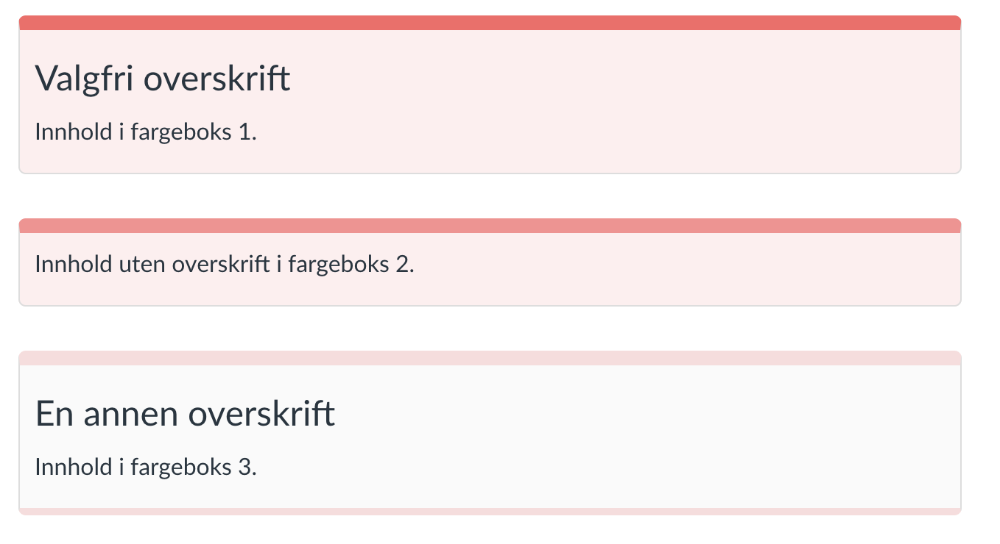

-------------------------

## Legge til figurer

Du kan legge til figurer på følgende måte:

```rst
.. figure:: ../images/ChatGPT_howLLMswork.png
   :align: center
   :width: 60%
   :alt: Illustrasjon av tekstgenerering med LLM

   Og dette blir bildeteksten
```

**NB** Husk å også laste opp figurene til github i folderen `source/images` - ellers vil ikke byggingen finne filen!

-------------------------

## Nyttig Sphinx-dokumentasjon

- [reStructuredText Primer](https://www.sphinx-doc.org/en/master/usage/restructuredtext/basics.html)
- [Read the Docs Theme-dokumentasjon](https://sphinx-rtd-theme.readthedocs.io/)


---

## Bygge dokumentasjonen

For å bygge dokumentasjonen lokalt:

```bash
cd ki-kurs-intro
python -m venv venv
source venv/bin/activate
pip install -r requirements.txt
make html
```

Den bygde HTML-en vil være i `_build/html/episodes`.

---

## Arbeidsflyt

1. Rediger RST-filer i `source/episodes/`
2. Commit endringer til GitHub
3. GitHub Actions vil automatisk bygge HTML-filene
4. HTML-filer lagres i `html-pages`-grenen
5. Oppdater Canvas-sider enten manuelt eller via REST API-skriptet

For detaljerte arbeidsflysinstruksjoner, se hoved-[README.md](README.md).

---

## Canvas-kompatibilitet

Alle tilpassede direktiver er designet for å være kompatible med UiO Canvas. Den genererte HTML-en:
- Bruker UiO-spesifikke CSS-klasser:
  - Ikonbokser: `uio-icon-box` med varianter `task`, `reflect`, `source`, `do`, `dont`, `info`
  - `uio-custom-box` bruker `uio-icon-box` med kantfargen som inline-stil (ingen ny CSS-klasse)
  - Fargebokser: `uio-color-box-1`, `uio-color-box-2`, `uio-color-box-3`
  - Rutenett: `uio-grid-row` med kolonner `col-lg`
- Unngår JavaScript der det er mulig (faner bruker URL-fragmenter)
- Følger UiOs designretningslinjer for tilgjengelighet og visuell konsistens

## Endringer og oppdateringer

**Fjernede direktiver:**
- `uio-note` - erstattet med `uio-info` for informasjonsbokser og `uio-source` for kilder/ressurser
- `uio-exercise` - erstattet med `uio-task` for konsistens med Canvas CSS-klassenavn
- `uio-question` - erstattet med `uio-task` for konsistens med Canvas CSS-klassenavn
- `uio-solution` - erstattet med `uio-answer` for å forenkle (begge er sammenleggbare svar)

**Nye direktiver:**
- `uio-task` - oppgavecontainer som kan bruke `uio-answer` (erstatter `uio-exercise` og `uio-question`)
- `uio-info` - informasjonsboks med blått info-ikon
- `uio-source` - kilde/ressurser-boks med kildeikon
- `uio-colorbox-1`, `uio-colorbox-2`, `uio-colorbox-3` - fargede bokser uten ikon
- `uio-custom-box` - ikonboks der du selv velger kantfarge med `:color:` (og eventuelt `:background:`)
- `uio-do-dont` - rutenettcontainer for å vise gjør/ikke-gjør-innhold side-ved-side


