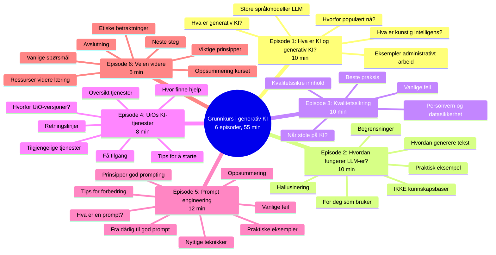
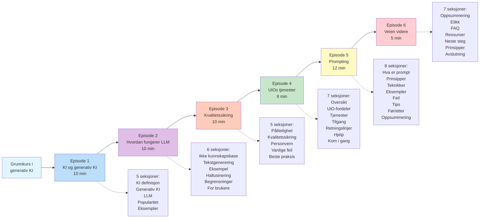
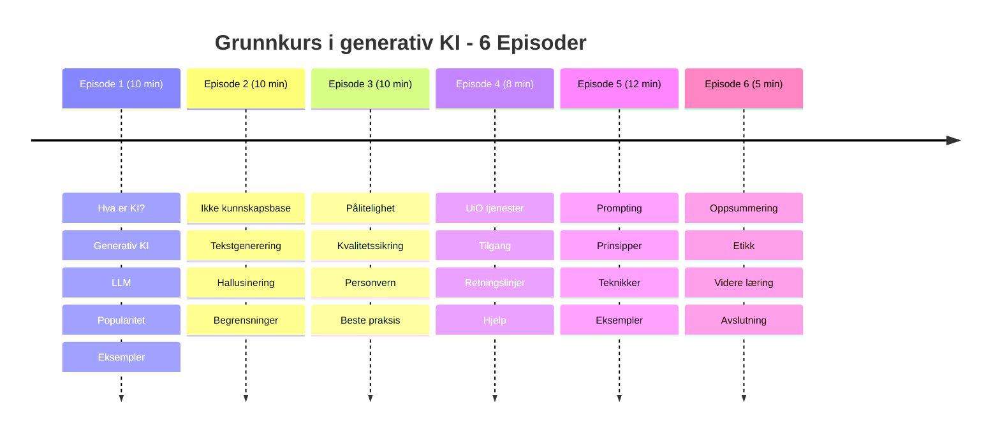

# Grunnkurs i generativ KI - Mermaid Diagram

## Option 1: Mindmap Style

## Option 2: Flowchart Style (Top to Bottom)

```mermaid
graph TD
    Start[Grunnkurs i generativ KI<br/>6 episoder - 55 minutter]

    Start --> E1[Episode 1: Hva er KI og generativ KI?<br/>10 minutter]
    Start --> E2[Episode 2: Hvordan fungerer LLM-er?<br/>10 minutter]
    Start --> E3[Episode 3: Kvalitetssikring<br/>10 minutter]
    Start --> E4[Episode 4: UiOs KI-tjenester<br/>8 minutter]
    Start --> E5[Episode 5: Prompt engineering<br/>12 minutter]
    Start --> E6[Episode 6: Veien videre<br/>5 minutter]

    E1 --> E1_1[Hva er kunstig intelligens?]
    E1 --> E1_2[Hva er generativ KI?]
    E1 --> E1_3[Store språkmodeller LLM]
    E1 --> E1_4[Hvorfor populært nå?]
    E1 --> E1_5[Eksempler administrativt arbeid]

    E2 --> E2_1[IKKE kunnskapsbaser]
    E2 --> E2_2[Hvordan generere tekst]
    E2 --> E2_3[Praktisk eksempel]
    E2 --> E2_4[Hallusinering]
    E2 --> E2_5[Begrensninger]
    E2 --> E2_6[For deg som bruker]

    E3 --> E3_1[Når stole på KI?]
    E3 --> E3_2[Kvalitetssikre innhold]
    E3 --> E3_3[Personvern og datasikkerhet]
    E3 --> E3_4[Vanlige feil]
    E3 --> E3_5[Beste praksis]

    E4 --> E4_1[Oversikt tjenester]
    E4 --> E4_2[Hvorfor UiO-versjoner?]
    E4 --> E4_3[Tilgjengelige tjenester]
    E4 --> E4_4[Få tilgang]
    E4 --> E4_5[Retningslinjer]
    E4 --> E4_6[Hvor finne hjelp]
    E4 --> E4_7[Tips for å starte]

    E5 --> E5_1[Hva er en prompt?]
    E5 --> E5_2[Prinsipper god prompting]
    E5 --> E5_3[Nyttige teknikker]
    E5 --> E5_4[Praktiske eksempler]
    E5 --> E5_5[Vanlige feil]
    E5 --> E5_6[Tips for forbedring]
    E5 --> E5_7[Fra dårlig til god prompt]
    E5 --> E5_8[Oppsummering]

    E6 --> E6_1[Oppsummering kurset]
    E6 --> E6_2[Etiske betraktninger]
    E6 --> E6_3[Vanlige spørsmål]
    E6 --> E6_4[Ressurser videre læring]
    E6 --> E6_5[Neste steg]
    E6 --> E6_6[Viktige prinsipper]
    E6 --> E6_7[Avslutning]

    style Start fill:#e1f5ff
    style E1 fill:#bbdefb
    style E2 fill:#e1bee7
    style E3 fill:#ffccbc
    style E4 fill:#c8e6c9
    style E5 fill:#fff9c4
    style E6 fill:#ffcdd2
```

## Option 3: Left to Right Flow

## Option 4: Compact Timeline

---

## How to Use

Copy any of the diagram code blocks above and paste into a `.md` file in your GitHub repository. GitHub will automatically render the Mermaid diagram.

You can also view it in:
- GitHub README files
- GitHub Wiki pages
- Any markdown file in a GitHub repository
- Visual Studio Code with Mermaid extension
- Many other markdown editors with Mermaid support
