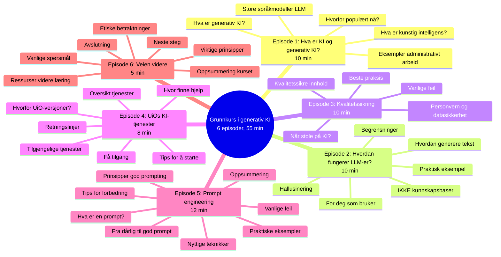

```mermaid
mindmap
  root((Grunnkurs i generativ KI<br/>6 episoder, 55 min))
    Episode 1: Hva er KI og generativ KI?<br/>10 min
      Hva er kunstig intelligens?
      Hva er generativ KI?
      Store språkmodeller LLM
      Hvorfor populært nå?
      Eksempler administrativt arbeid
    Episode 2: Hvordan fungerer LLM-er?<br/>10 min
      IKKE kunnskapsbaser
      Hvordan generere tekst
      Praktisk eksempel
      Hallusinering
      Begrensninger
      For deg som bruker
    Episode 3: Kvalitetssikring<br/>10 min
      Når stole på KI?
      Kvalitetssikre innhold
      Personvern og datasikkerhet
      Vanlige feil
      Beste praksis
    Episode 4: UiOs KI-tjenester<br/>8 min
      Oversikt tjenester
      Hvorfor UiO-versjoner?
      Tilgjengelige tjenester
      Få tilgang
      Retningslinjer
      Hvor finne hjelp
      Tips for å starte
    Episode 5: Prompt engineering<br/>12 min
      Hva er en prompt?
      Prinsipper god prompting
      Nyttige teknikker
      Praktiske eksempler
      Vanlige feil
      Tips for forbedring
      Fra dårlig til god prompt
      Oppsummering
    Episode 6: Veien videre<br/>5 min
      Oppsummering kurset
      Etiske betraktninger
      Vanlige spørsmål
      Ressurser videre læring
      Neste steg
      Viktige prinsipper
      Avslutning
```
