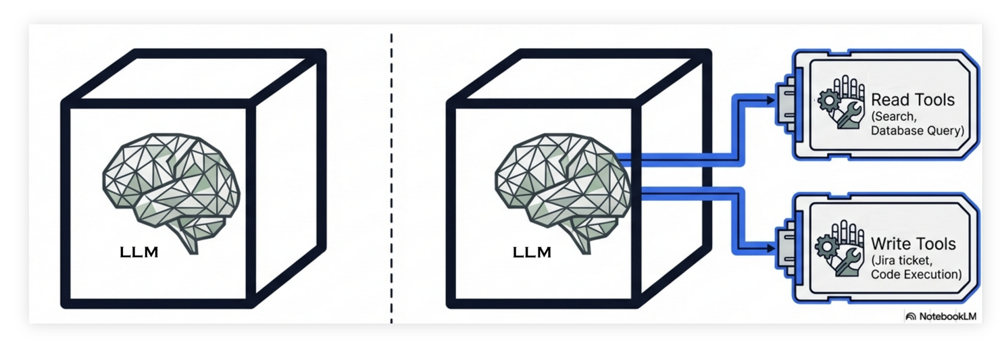
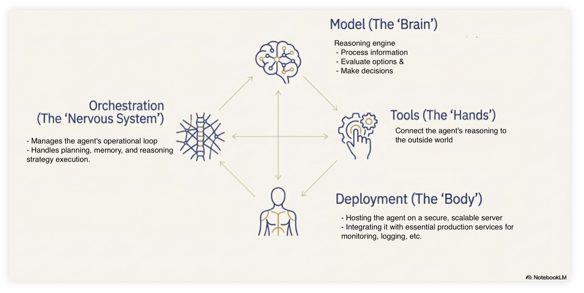

KI-agenter
====================

Du har kanskje hørt om KI-agenter eller agentisk KI? 
Dette er en type KI som er mer enn bare en chat-tjeneste, den har en språkmodell som motor på samme måte som med chat, men kan i tillegg utføre bestemte handlinger.

Agenter er laget for en eller flere spesifikke formål. En agent kan for eksempel hente informasjon fra andre systemer som internett eller en database, 
den kan kanskje bestille togbiletter for deg, eller slå av en datamaskin som har symptomer på å være under angrep utenfra. 
Eller helt andre ting avhengig av hva som er formålet med akkurat den agenten.

   Forskjellen mellom en vanlig språkmodell (venstre) og en agentisk KI med tilgang til verktøy (høyre). 
   En agent kan ta autonome beslutninger om å bruke verktøy for å aksessere eller endre ekstern data. 

Hvordan er en KI-agent bygd opp?
--------------------------

En KI-agent består av flere komponenter som jobber sammen. 

   Komponenter i en KI-agent. 

Komponenter i en KI-agent

* modellen ("hjernen") prosesserer informasjon
* orkestreringsystemet ("nervesystemet") styrer agentens flyt
* verktøyene ("hendene") kobler agenten til omverdenen
* deployment ("kroppen") gjør agenten tilgjengelig som en tjeneste. For eksempel
   * datamaskinene tjenesten kjører på
   * oppkobling mot systemer tjenesten skal ha tilgang til (som for eksempel databaser)

Den viktigste komponenten som gjør agenten til en agent er verktøyene. Verktøyene er spesiallagede komponenter som gjør spesifikke handlinger (søke i en database, bestille en togbillett, gå gjennom møtedeltakernes kalendre, booke rom og sende ut møteinnkalling). 
Men i tillegg har en agent et mye mer avansert orkestreringsssystem enn det en vanlig chat tjeneste har.
En vanlig chat tjeneste håndterer bare instruksjoner fra brukeren, og lever tilbake svar fra språkmodellen. 
En agent må håndtere instruksjoner fra en bruker, den må håndtere og hente ut informasjon om systemet den kjører på, kjenne til hvilke verktøy den kan bruke, håndtere resultater levert fra verktøyene, og ikke minst må den bestemme når og hvilke verktøy som skal brukes i en gitt kontekst.

Risiko knyttet til KI-agenter
------------------------------

Det er mye høyere risiko involvert med agenter sammenlignet med en ren chat tjeneste. 
Begge har de samme svakheter og begrensninger alle systemer har som genererer output fra en språkmodell (troverdighet, hallusinasjon, ikke fakta basert, ikke reproduserbart).
Men fordi en agent samhandler med den fysiske, virkelige verden kan konsekvensene av en feil bli betydelig større. 
Spesielt hvis man lar agenten operere autonomt, det vil si uten at et menneske godkjenner eller kontrollerer handlingen.

.. uio-task:: Refleksjonsoppgave

    Tenk deg en fremtid der Universitetet i Oslo har tatt i bruk en agent som skal avdekke og reagere på fusk på eksamen.

    Agenten 

    * leser gjennom eksamensoppgaven, sensorveiledningen og besvarelsen
    * har tilgang til kandidatens tidligere besvarelser
    * har tilgang til reglene for fusk ved Universitetet i Oslo
    * har en innebygget fusk-detektor
    * tar en beslutning om besvarelsen er gyldig eller anses som fusk
    * dersom fusk: annulerer eksamen og utestenger hen fra Universitetet dersom alvorlighetsgraden tilsier det

    Risikoen ved et slikt system er åpenbar: hva om systemet tar feil og feilaktig bedømmer en besvarelse som fusk? 
    Hva kan man gjøre for å redusere denne risikoen? 
    
    .. uio-detail:: Forslag til svar

        * Kunne kjenne til hvordan fusk detektoren fungerer, ingen "black box".
        * Kunne gå vurderingen grundig i sømmene
           * Sikre at det er loggført hva beslutningen er basert på
           * Sikre at en sensor lett kan finne frem til steder i besvarelsen som anses som fusk
        * Ikke under noen omstendighet la agenten faktisk *ta beslutningen selv*, det vil si faktisk annulere eksamen eller utføre andre handlinger som får konsekvenser for kandidaten, uten at et menneske har godkjent handlingen
