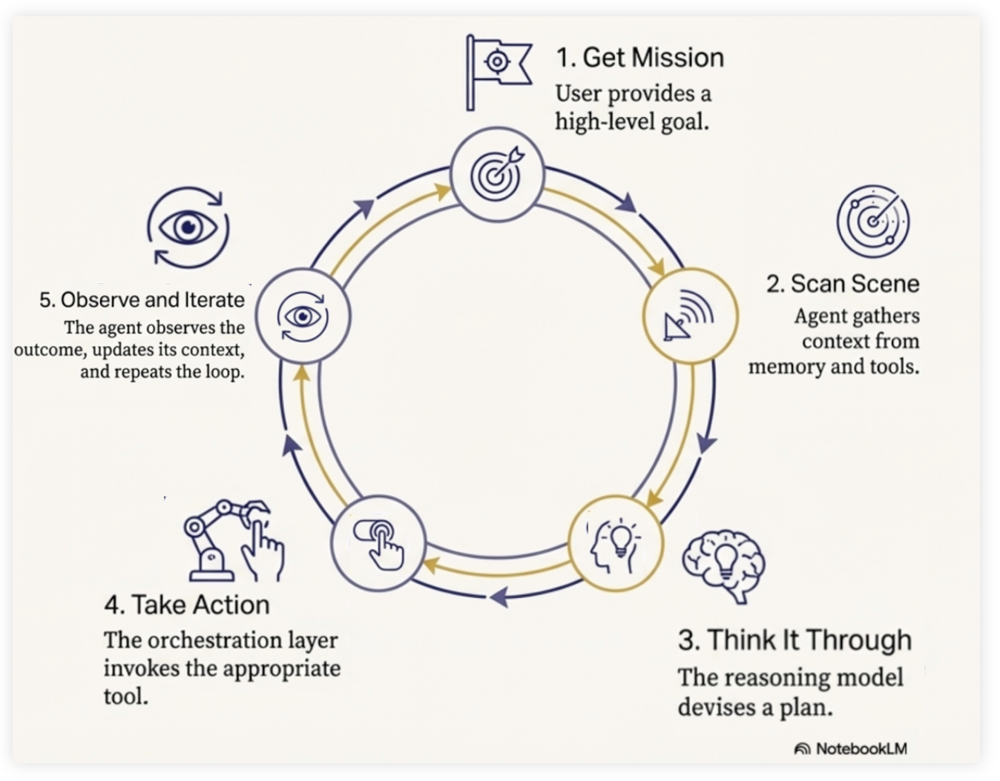

Hva er agentisk KI?
====================

Du har kanskje hørt om agentisk KI eller KI agenter?
Dette er en type KI som benytter generativ KI som motor/hjerne, men kan i tillegg utføre handlinger.

Så mens en ren KI chat tjeneste kun genererer tekst (teksten genereres av språkmodellen), så kan en KI agent både generere tekst,
for eksempel hente informasjon fra andre systemer som internett eller en database, den kan kanskje bestille togbiletter for deg,
eller andre ting avhengig av hva som er formålet med akkurat den agenten.

.. figure:: ../images/tools.png
   :align: center
   :width: 70%
   :alt: Illustrasjon som viser forskjellen mellom en vanlig språkmodell og en språkmodell med verktøy

   Forskjellen mellom en vanlig språkmodell (venstre) og en agentisk KI med tilgang til verktøy (høyre). En agent kan bruke verktøy som å lese og skrive data for å utføre handlinger.

Komponenter i en KI-agent
--------------------------

En KI-agent består av flere komponenter som jobber sammen. 

* modellen ("hjernen") prosesserer informasjon
* orkestreringsystemet ("nervesystemet") styrer agentens flyt
* verktøyene ("hendene") kobler agenten til omverdenen
* deployment ("kroppen") gjør agenten tilgjengelig som en tjeneste
  *  Deployment er for eksempel datamaskinene tjenesten kjører på og systemer tjenesten har tilgang til.

.. figure:: ../images/agent_components.png
   :align: center
   :width: 80%
   :alt: Diagram som viser komponentene i en KI-agent med modell, orkestrering, verktøy og deployment

   Komponenter i en KI-agent. 

Hvordan en KI-agent jobber
---------------------------

En KI-agent jobber i en kontinuerlig syklus:

   Agent-pipeline: (1) Få oppdrag fra bruker, (2) Samle kontekst og informasjon, (3) Tenke gjennom og planlegge, (4) Utføre handlinger med riktig verktøy, (5) Observere resultatet og gjenta syklusen om nødvendig.

Hva er hovedproblemene med agentisk KI. (For å etterpå si noe om hvordan sikrere bruke agentisk KI)