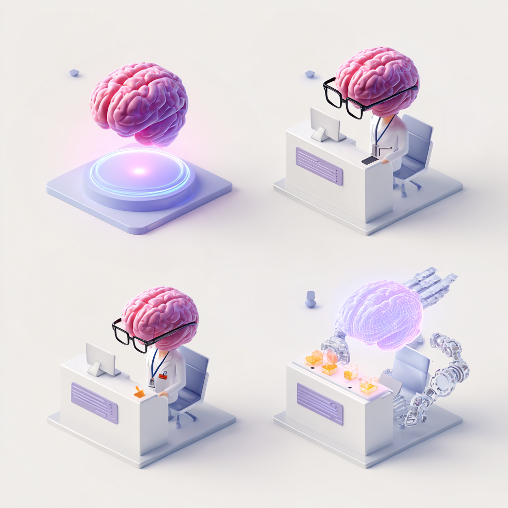

KI økosystemet
===============

Når vi snakker om kunstig intelligens, blander vi ofte sammen "hjernen" som tenker, og systemet som lar oss snakke med den.
For å forstå hvordan alt henger sammen, kan vi bruke en arbeidsplass som analogi.

   KI-økosystemet illustrert som en arbeidsplass med hjerne, kontor, assistenter og agenter.

Språkmodellen (LLM): "Hjernen"
------------------------------

Dette er selve den kunstige intelligensen (f.eks. GPT-5.4 eller Gemini 3). 
Tenk på dette som en enorm, superintelligent hjerne, men uten noen kropp. 
Den kan utrolig mye, men den har ingen munn til å snakke med, ingen hukommelse om hvem du er, og ingen en skrivepult å jobbe ved. 
Den er ren regnekraft og språkforståelse.

KI-tjenesten:  "Kontoret og resepsjonen"
-----------------------------------------

For at vi skal kunne snakke med hjernen, må vi gi den en "arbeidsplass": et kontor og en resepsjon. 
KI-tjenesten bygger dette arbeidsplassen. 
Tjenesten gir hjernen en resepsjonsluke (et pent chat-vindu), en notisblokk (så den husker samtalen din fra i går), og et arkivskap (hvor du kan laste opp filer).

.. uio-colorbox-3:: 

    Eksempler: ChatGPT, NotebookLM og GPT UiO.

    Forskjellige arbeidsplasser har ulikt utstyr: NotebookLM har utstyrt kontoret med et podcast-studio og verktøy for å lage quizer, mens GPT UiO er en klassisk, sikker resepsjon for universitetet.

.. uio-colorbox-3:: Bytte hjernen

    Siden kontoret (tjenesten) og hjernen (modellen) er to forskjellige ting, 
    kan vi faktisk bytte ut hvem som sitter på kontoret! I GPT UiO er chat-vinduet og knappene alltid de samme. Men via en meny kan du bestemme om du vil at det er "GPT-hjernen" eller "Mistral-hjernen" som skal sitte bak skrivebordet og svare deg.

KI-assistenter: "Eksperten med stillingsinstruks"
---------------------------------------------------

Inne i en KI-tjeneste kan du ofte lage Assistenter. 
Dette er som å gi hjernen en veldig spesifikk jobb og en uniform. 
I stedet for å være en generell altmuligmann, gir du den en stillingsinstruks, en bestemt tone, og kanskje noen faste oppslagsverk. 
Da har du plutselig ansatt en "Fransk-lærer", en "Kodesjekker" eller en "Eksamens-hjelper" som alltid holder seg i rollen.

KI-agenter: "Medarbeideren med egne hender"
----------------------------------------------

Agenter er det neste, store nivået. En vanlig assistent sitter bare i resepsjonen og prater med deg. 
En KI-agent er en medarbeider som har fått armer, ben og fullmakter. 
Du gir agenten et mål, og den kan på egenhånd forlate resepsjonen for å søke på internett, åpne Excel, sende e-poster eller booke møter i kalenderen din. 
Den nøyer seg ikke med å fortelle deg hvordan du løser en oppgave, den utfører oppgaven for deg

.. uio-colorbox-3::

    Hvis jeg ber henholdsvis en KI-assistent og en KI-agent om å bestille en flybillett fra Norwegian for meg så vil

    .. canvas-tabs:: 
        
        .. canvas-tab:: KI-assistenten

            *fortelle meg* hvordan bestille billetten

        .. canvas-tab:: KI-agenten

            gå til norwegian.no og *bestille* den for meg. 
