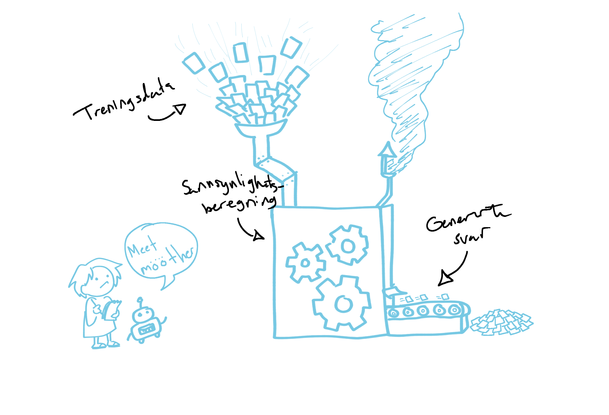

Store språkmodeller 
================================

I dette kapittelet vil du øke forståelen din for hvordan store språkmodeller (også kalt LLM-er) genererer tekst, og hvilke svakheter modellen har når den svarer deg. Denne kunnskapen er nødvendig for å kunne bruke KI-verktøy på en trygg og ansvarlig måte.

.. uio-colorbox-1:: Etter dette kapitellet kan du:

    * Forklare hvordan store sopråkmodeller generer tekst
    * Forklare hvorfor store språkmodeller ikke er pålitelige kunnskapsbaser
    * Gjenkjenne når en språkmodellene kan gi feil informasjon

