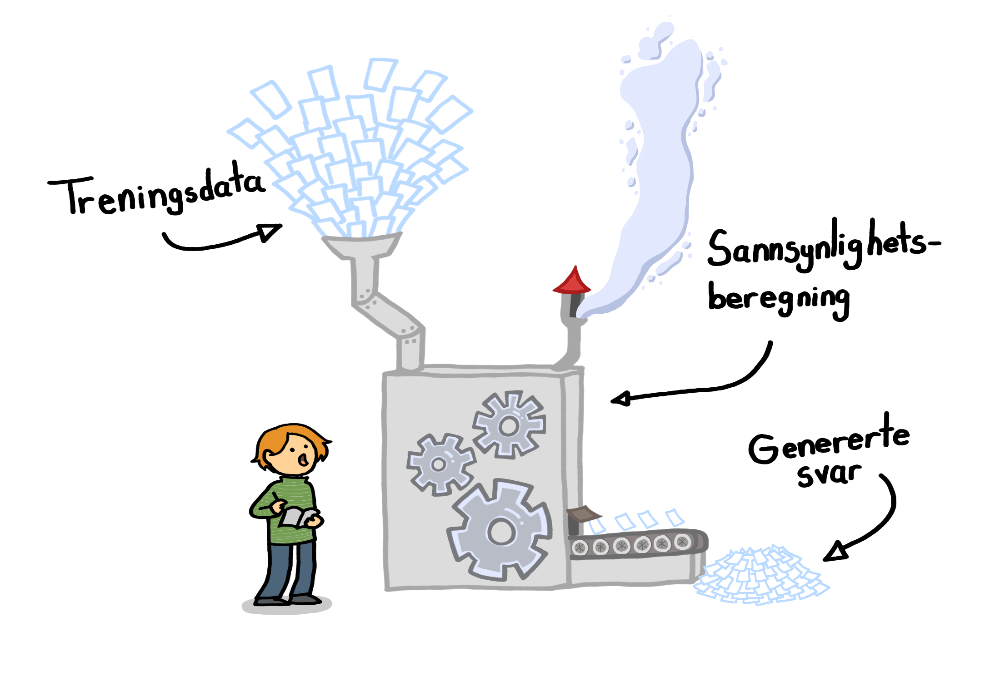

Store språkmodeller
====================
Som du nettopp har lært, er store språkmodeller selve motoren i mange KI-tjenester. 
Nå skal vi se nærmere på hvordan store språkmodeller lager tekst og hva vi skal være på vakt mot.
Denne kunnskapen er en nødvendig forutsetning for å bruke KI på en trygg og ansvarlig måte.

    Illustrasjon: Tina Morønning Ruud

.. uio-colorbox-1:: Læringsmål

    * Jeg forstår hvordan store språkmodeller generer tekst
    * Jeg forstår svakhetene i store språkmodeller og kan kjenne igjen når språkmodellene gir feil informasjon

