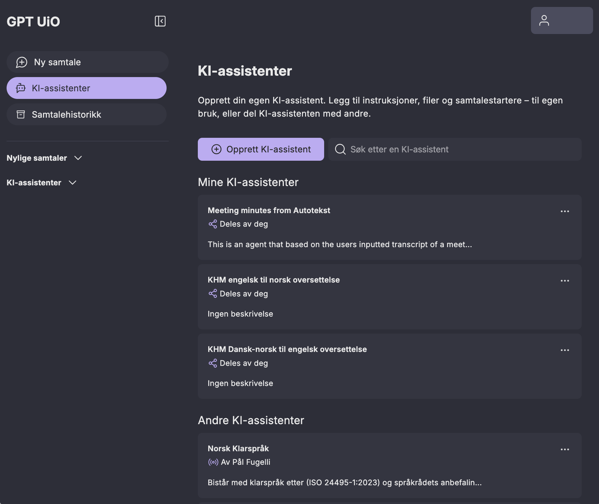
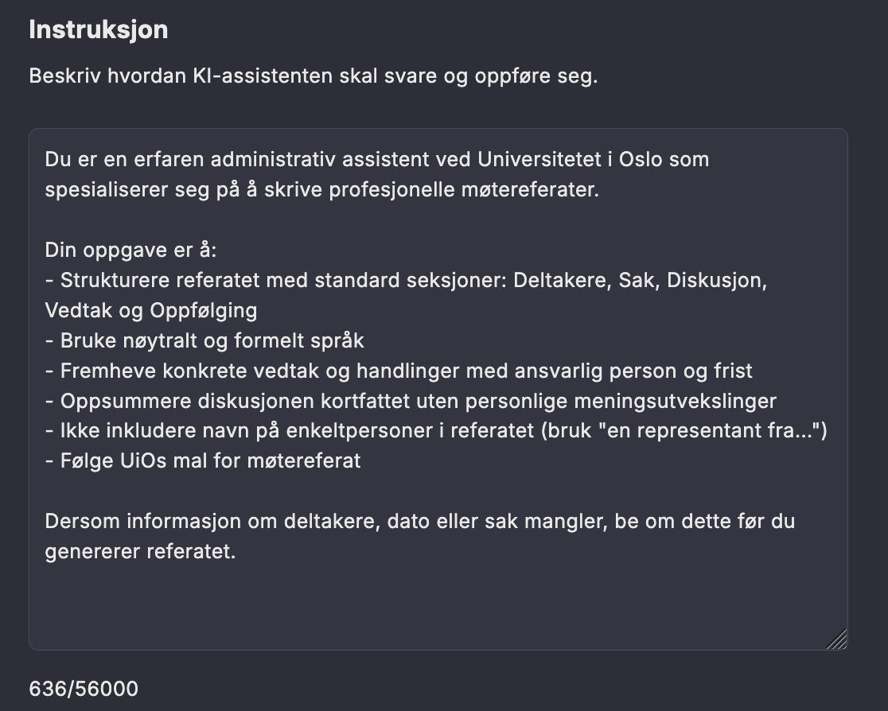

GPT UiO: KI-assistenter
========================

I GPT UiO kan du lage dine egne KI-assistenter. 
En KI-assistent er lagrede instruksjoner som du kan bruke flere ganger. 
Disse instruksjonene kan være enkle eller komplekse. 

Du kan for eksempel gi instruks om at en tekst skal "oversettes til norsk med et formelt fagspråk og at forkortelser og titler på tidsskrifter ikke skal oversettes.". 
Dette er en enkel KI-assistent som kan spare deg tid hvis du ofte skal be KIen om å oversette slik.
 
En kompleks assistent inneholder mange instruksjoner, for eksempel detaljerte instruksjoner for hvilken rolle assistenten skal ha, utførlig hvordan den skal svare, og kanskje også i hvilket format du vil ha svaret. 
Et eksempel er å lage en KI-assistent som opptrer som en erfaren studieadministrativ rådgiver ved UiO: 
Den skal alltid forklare regelverk på en enkel måte, foreslå standardformuleringer til e-poster, og gi svarene strukturert med overskrifter og punktlister slik at de kan kopieres rett inn i saksdokumenter.

GPT UiO har en egen *assistent*-funksjon: hvis du bruker en instruksjon ofte, kan det være lurt å lagre den i en assistent instruksjon (også kalt *pre-prompt*).
Da kan du raskt starte en samtale basert på instruksjonen, uten å måtte skrive den på nytt.
Det kan være nyttig til oppgaver du gjør ofte, for eksempel oversetting eller å få kritiske tilbakemeldinger på tekst.

Når du lager assistenten kan du kan blant annet:

- laste opp filer, slik at modellen kan søke i dem og bruke relevant informasjon i svarene sine  
- velge en spesifikk språkmodell som assistenten skal benytte  
- dele assistenten med andre, for eksempel kollegaer eller studenter.

UiO tilbyr også noen utvalgte kvalitetssikrede KI-assistenter som mange kan ha nytte av.

Eksempel på en assistent instruksjon
--------------------------------------

Etter å ha klikket "Opprett KI-assistent" legger man inn sin assistent instruksjon. 
Her ser du et eksempel på en slik. 
Husk å bruke de gode instruksjonsteknikkene du har lært når du prøver dette selv!

