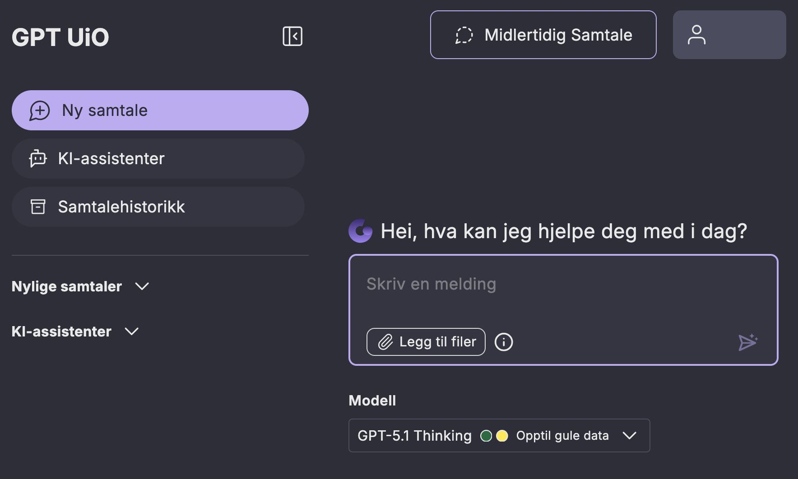

GPT UiO
========

GPT UiO er UiOs sin egenutviklede personverntrygge KI-chat. 
Den fungerer stort sett som andre KI-chat tjenester: Du kommuniserer med språkmodellen via et chat-vindu.

Den store fordelen med å bruke GPT UiO er at data som lagres, blir lagret på UiOs egne servere.
Navnet ditt og brukernavnet ditt deles ikke med andre selskaper, bare UiO har tilgang til denne informasjonen.
I tillegg brukes ikke samtalene dine til videre trening av språkmodellene.
Og sist men ikke minst: du kan bruke GPT UiO med opptil røde data, men bare hvis du velger egnet modell.

På de neste sidene skal vi dykke dypere inn i to viktige funksjonaliteter ved GPT UiO, nettopp muligheten for å velge blant flere språkmodeller, i tillegg til GPT UiO sine KI assistenter.

