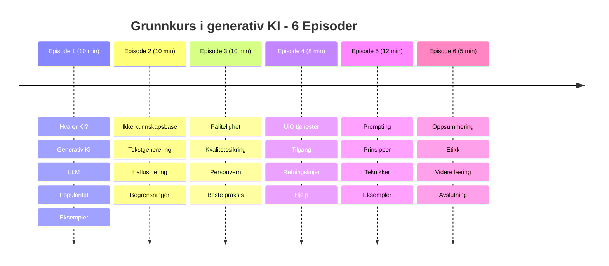

```mermaid
timeline
    title Grunnkurs i generativ KI - 6 Episoder

    Episode 1 (10 min) : Hva er KI? : Generativ KI : LLM : Popularitet : Eksempler
    Episode 2 (10 min) : Ikke kunnskapsbase : Tekstgenerering : Hallusinering : Begrensninger
    Episode 3 (10 min) : Pålitelighet : Kvalitetssikring : Personvern : Beste praksis
    Episode 4 (8 min) : UiO tjenester : Tilgang : Retningslinjer : Hjelp
    Episode 5 (12 min) : Prompting : Prinsipper : Teknikker : Eksempler
    Episode 6 (5 min) : Oppsummering : Etikk : Videre læring : Avslutning
```
