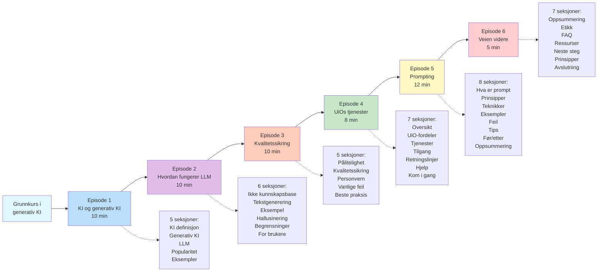

```mermaid
graph LR
    Start[Grunnkurs i<br/>generativ KI]

    Start --> E1[Episode 1<br/>KI og generativ KI<br/>10 min]
    E1 --> E2[Episode 2<br/>Hvordan fungerer LLM<br/>10 min]
    E2 --> E3[Episode 3<br/>Kvalitetssikring<br/>10 min]
    E3 --> E4[Episode 4<br/>UiOs tjenester<br/>8 min]
    E4 --> E5[Episode 5<br/>Prompting<br/>12 min]
    E5 --> E6[Episode 6<br/>Veien videre<br/>5 min]

    E1 -.-> E1S[5 seksjoner:<br/>KI definisjon<br/>Generativ KI<br/>LLM<br/>Popularitet<br/>Eksempler]
    E2 -.-> E2S[6 seksjoner:<br/>Ikke kunnskapsbase<br/>Tekstgenerering<br/>Eksempel<br/>Hallusinering<br/>Begrensninger<br/>For brukere]
    E3 -.-> E3S[5 seksjoner:<br/>Pålitelighet<br/>Kvalitetssikring<br/>Personvern<br/>Vanlige feil<br/>Beste praksis]
    E4 -.-> E4S[7 seksjoner:<br/>Oversikt<br/>UiO-fordeler<br/>Tjenester<br/>Tilgang<br/>Retningslinjer<br/>Hjelp<br/>Kom i gang]
    E5 -.-> E5S[8 seksjoner:<br/>Hva er prompt<br/>Prinsipper<br/>Teknikker<br/>Eksempler<br/>Feil<br/>Tips<br/>Før/etter<br/>Oppsummering]
    E6 -.-> E6S[7 seksjoner:<br/>Oppsummering<br/>Etikk<br/>FAQ<br/>Ressurser<br/>Neste steg<br/>Prinsipper<br/>Avslutning]

    style Start fill:#e1f5ff
    style E1 fill:#bbdefb
    style E2 fill:#e1bee7
    style E3 fill:#ffccbc
    style E4 fill:#c8e6c9
    style E5 fill:#fff9c4
    style E6 fill:#ffcdd2
```
